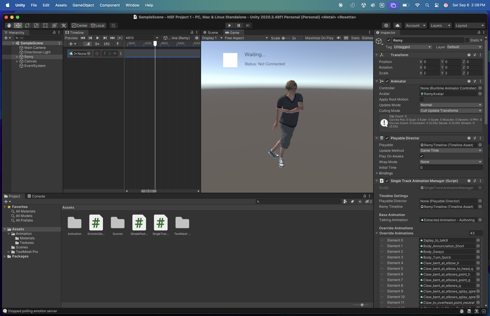

# deepface-realtime-emotion-animation-system
This program should hopefully be a guide on how to implement a realtime software that reads data from deepface and can translate it to unity where the program reads the users face and updates the animation timeline.

  

## Features
- Real-time facial emotion detection using DeepFace
- Unity Timeline integration with animation overrides
- Timestamp-based animation triggering
- Copy-paste timestamp configuration
- Automatic server connection with fallbacks (runs locally)
- 5-second animation bursts at specified moments

## How It Works
1. Python server analyzes your face via webcam
2. Detects neutral emotion with 98%+ confidence
3. Unity triggers animation at predefined timestamps
4. Returns to base animation after 5-second override (you can change that interval)

## Built With
- **Python**: DeepFace, OpenCV, Flask
- **Unity**: Timeline API, UnityWebRequest
- **Communication**: REST API with JSON

## Quick Start
### Prerequisites
- Python 3.9.2 was used to develope this (use versions 9.3+ at your own risk)
- Unity 2020.3.48f1+
- Webcam

### 5-Minute Setup
1. Clone repository
2. Install Python dependencies: `pip install -r python-server/requirements.txt`
3. Run server: `python python-server/emotion_detection_server.py`
4. Import Unity scripts into your project
5. Paste timestamps: `[0:06–0:39, 0:40–0:54, 0:55–1:16]`
